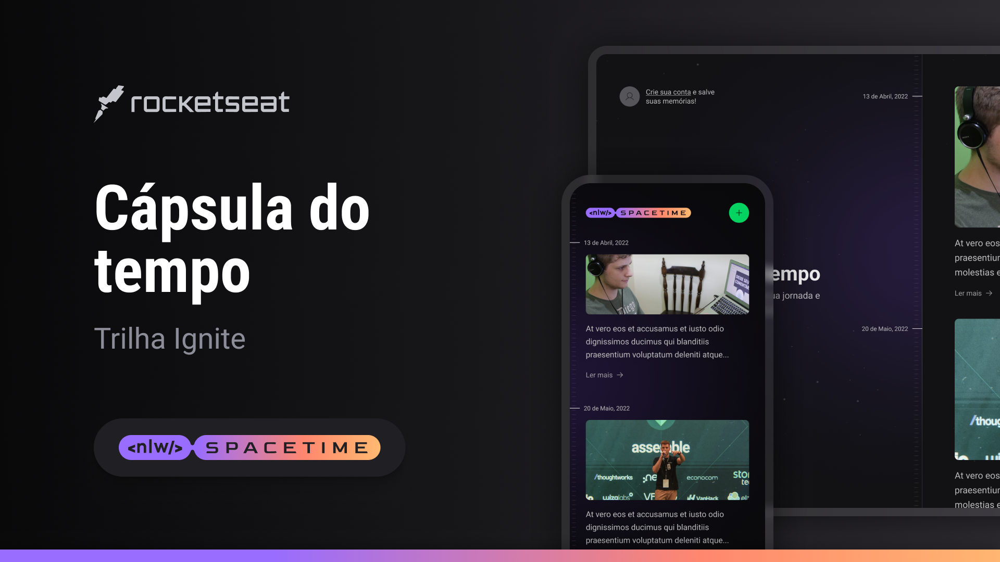

<h1 align="center">
  NLW Spacetime 
</h1>

## 💻 Projeto

  

Projeto desenvolvido no evento Next Level Week da Rocketseat, uma aplicação de recordação de memórias, onde o usuário poderá adicionar à uma timeline textos, fotos e vídeos de acontecimentos marcantes da sua vida, organizados por mês e ano.

## 🚀 Tecnologias

Desenvolvemos uma aplicação full-stack, do back-end ao mobile, que funcionará como uma cápsula do tempo guardando memórias passadas numa timeline

- Na primeira aula configuramos todo o ambiente.
- Codamos a interface na web e mobile utilizando TailwindCSS para estilização, criamos a estrutura base do banco de dados utilizando Prisma e a criação de rotas no back end o famoso CRUD.
- Criamos todo o fluxo de autenticação usando Oauth do GitHub que permiti que um site ou aplicativo acesse recursos hospedados por outros aplicativos da web em nome de um usuário.
- No BackEnd criamos o token JWT para guardamos as informações do usuário e salvar no Cookie do navegador, assim no Front End podemos autentica-lo e exibir suas informações.
- No mobile é praticamente o mesmo processo.
- Criação de layout e rotas, Middleware de autenticação, upload de arquivos utilizando stream do node com o plug-in multipart do fastify.

### Este projeto foi desenvolvido com as seguintes tecnologias:

- ReactJS
- Tailwind
- NodeJS
- Fastify
- TypeScript
- Expo
- NextJS
- Insomnia
- Prisma

Desenvolvido ♥ por Kauane Vieira 👋🏻